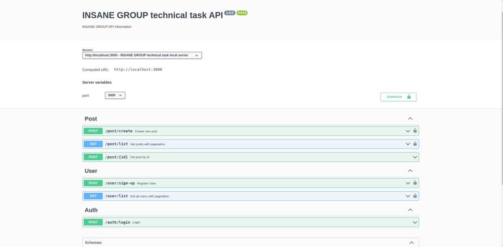

# INSANE GROUP TECHNICAL TASK GUIDE

```bash
    uz --> Bu loyiha INSANE GROUP technical taski uchun yaratildi
    
    ru --> Данный проект создан по техническому заданию INSANE GROUP
    
    en --> This project was created for INSANE GROUP technical task
```

## Installation

uz --> Projectning kerakli kutubxonalari va dependecylarini o'rnatish uchun

ru --> Для установки необходимых библиотек и зависимостей проекта

en --> To install all required libraries and third-party packages

```bash
    yarn install
```

## Running the application
Step 1:

uz --> Muhit o'zgaruvchilarini yaratish uchun .env.example faylini .env ga nusxalash

ru --> Чтобы создать переменные среды, скопируйте .env.example в .env.

en --> To create environment variables copy .env.example to .env

```bash
    cp .env.example .env
```

Step 2:
uz --> Mock informationlardan foydalanib database ma'lumotlarini yaratish va to'ldirish

ru --> Создание информации о базе данных с использованием mock данных

en --> Create and fill database collection information by using mock data

```bash
    yarn run:seed
```

Step 3:

uz --> Dasturni ishga tushirish

ru --> Запуск приложения

en --> Running the app

```bash
# development mode
    yarn start
  
# watch mode
    yarn start:dev
    
# production mode
    yarn start:prod
```

uz --> Bu kichik loyihada userlarni ro'yxatga olish ularni autentifikatsiya qilish, ularning post yaratishi va user va postlarni pagination asosida olish imkoniyatlari yaratilgan. Har bir feature uchun maxsus validatsiy yo'lga qo'yilgan, dokumentatsiya uchun SWAGGER yaratilgan

ru --> В этом подпроекте можно регистрировать пользователей, аутентифицировать их, создавать сообщения и извлекать пользователей и сообщения на основе нумерации страниц. Для каждой feature реализована специальная валидация, для документирования создан SWAGGER

en --> In this sub-project, it is possible to register users, authenticate them, create posts, and retrieve users and posts based on pagination. For each feature, special validation is implemented, SWAGGER is created for documentation

<p align="center">
    
</p>
